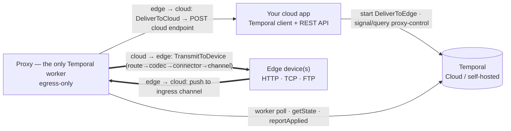

# Cloud ↔ Edge Durable Proxy

A **domain-agnostic, durable connector** that bridges any **Cloud** application and any **Edge**
target (on-prem device, machine, or network) in both directions, with **Temporal** as the durable
backbone. One proxy per install, **egress-only** (the edge site opens no inbound ports), and
operator-configurable at runtime with **no redeploys**.

This README is a guide for **forking the project and wiring it to your own cloud app**. For the
full design rationale see [PLAN.md](PLAN.md); the reference cloud/edge apps under
[`dummy-cloud/`](dummy-cloud/README.md) and [`dummy-edge/`](dummy-edge/README.md) are working
examples of everything described here.

---

## What it does

- Your **cloud app** dispatches messages to edge devices and receives messages back from them,
  without ever opening a connection _into_ the edge site.
- The **proxy** runs at the edge as the single Temporal worker. It speaks **HTTP, TCP (incl.
  custom/MLLP-style wire protocols and persistent heartbeated sockets), and FTP** to devices, and
  encodes/decodes **JSON, XML, or raw** payloads per message type.
- Temporal gives **exactly-once-style delivery** on top of at-least-once activities: duplicate
  dispatches and duplicate device pushes collapse to one execution, and an offline proxy just means
  work waits in Temporal and delivers on reconnect.
- Everything domain-specific — message types, codecs, cloud endpoints, devices, routes — is
  **operational state held in a Temporal workflow** and hot-applied by the proxy, so operators
  reconfigure through the **Switchyard** UI (or cloud API) with no restart.

## How it works



- **Control plane.** A singleton `ProxyControlWorkflow` (Workflow ID `proxy-control`) holds desired
  state `{enabled, devices[], catalog, version, …}`. Your cloud drives it with **signals**; the
  proxy **polls it via query**, a `Reconciler` hot-applies changes, and the proxy **reports its
  applied state back** — so the cloud sees desired-vs-applied without ever reaching into the proxy's
  network. `requestRestart`/`requestShutdown` signals make the proxy exit gracefully; paired with
  the supervisor wrapper that's a remote restart over egress-only gRPC.
- **Cloud → Edge.** Your cloud starts a `DeliverToEdge` **workflow** (Workflow ID
  `{messageType}-{businessId}`, reuse policy `REJECT_DUPLICATE` — duplicates collapse to one
  execution). The proxy worker runs it, executing a `TransmitToDevice` activity:
  route → codec → connector → device channel.
- **Edge → Cloud.** The device pushes to a proxy ingress **channel** (an HTTP path, TCP port, or FTP
  folder _on the proxy_). The channel — never the payload — identifies the message type. The proxy
  starts a `DeliverToCloud` standalone activity (Activity ID `{messageType}-{businessId}`, so
  identical pushes dedup to one delivery), acks the device only after Temporal accepted the enqueue,
  and the activity **POSTs to your cloud endpoint** until it gets a 2xx.

> **Egress-only** means the edge site exposes no inbound ports. The proxy only ever _dials out_:
> to Temporal (gRPC — control plus the cloud→edge data path) and to your cloud app's API (the
> edge→cloud delivery POST). Devices connect to the proxy on the LAN, or the proxy dials them.

## Repo layout

| Module                                      | What it is                                                                                                  |
| ------------------------------------------- | ----------------------------------------------------------------------------------------------------------- |
| [`proxy/`](proxy/)                          | The connector itself — the only Temporal worker, egress-only                                                |
| [`dummy-cloud/`](dummy-cloud/README.md)     | Reference cloud app (:8091) — Temporal **client only** (dispatch + control + receive endpoints)             |
| [`dummy-edge/`](dummy-edge/README.md)       | Reference edge target (:8092, TCP 9001, FTP 2222) — auto-confirms                                           |
| [`management-ui/`](management-ui/README.md) | **Switchyard** operations console (:3000, Next.js) — lifecycle, catalog, routing wizard, live Temporal feed |
| [`config/`](config/)                        | Demo routing/catalog configs for hot-reload / validation demos                                              |
| [`scripts/`](scripts/)                      | `proxy-supervisor.sh` — restart-on-exit wrapper for remote restarts                                         |
| [`justfile`](justfile)                      | Build + demo recipes (all run from this root)                                                               |

The root [pom.xml](pom.xml) is a Maven aggregator: `mvn package` builds all three apps.

---

## Make your cloud app a Temporal client

Your cloud app integrates with the proxy **by contract, not by shared code**: it connects to the
same Temporal namespace and speaks a handful of agreed names plus wire-compatible JSON. **Any
Temporal SDK works** — Go, Python, TypeScript, Java, .NET, PHP, Ruby — so the cloud app can be in
whatever language and framework you already use. The four pieces below _are_ the contract; the
collapsed snippets come from the reference impl ([`dummy-cloud/`](dummy-cloud/README.md), Java/Spring)
and are illustrative, not prescriptive.

### 1. Connect (a client, not a worker)

Create a Temporal client for your **namespace** and **server address** (a local server or Temporal
Cloud). The cloud app registers **no workflows or activities** and runs **no worker** — it only
starts workflows and sends signals/queries.

For **Temporal Cloud**, target `<ns-id>.<region>.tmprl.cloud:7233` with namespace
`<tenant>.<account-id>` and your client mTLS cert/key (every SDK exposes a TLS/credentials option).
The reference app connects without mTLS for local dev; see [Target Temporal Cloud](#target-temporal-cloud).

<details>
<summary>Reference (Java/Spring) — <a href="dummy-cloud/src/main/java/com/dummycloud/TemporalClientConfig.java"><code>TemporalClientConfig.java</code></a></summary>

```java
@Bean(destroyMethod = "shutdown")
public WorkflowServiceStubs serviceStubs(CloudProperties p) {
    return WorkflowServiceStubs.newServiceStubs(
        WorkflowServiceStubsOptions.newBuilder().setTarget(p.temporal().target()).build());
}

@Bean
public WorkflowClient workflowClient(WorkflowServiceStubs stubs, CloudProperties p) {
    return WorkflowClient.newInstance(stubs,
        WorkflowClientOptions.newBuilder().setNamespace(p.temporal().namespace()).build());
}
```

</details>

### 2. Dispatch Cloud → Edge

Start a workflow with these parameters; it lands in Temporal and the proxy worker runs it:

| Parameter       | Value                                                                                                                                                  |
| --------------- | ------------------------------------------------------------------------------------------------------------------------------------------------------ |
| Workflow type   | `DeliverToEdge`                                                                                                                                        |
| Task queue      | `proxy-main`                                                                                                                                           |
| Workflow ID     | `{messageType}-{businessId}` — e.g. `DEVICE_COMMAND-CMD-1001`                                                                                          |
| ID reuse policy | `REJECT_DUPLICATE` — a re-dispatch of the same business id collapses to one execution                                                                  |
| Input (JSON)    | `{ "messageType": "…", "businessId": "…", "payload": "…" }` — `payload` is the codec's wire string (JSON/XML/raw); the proxy encodes it for the device |

<details>
<summary>Reference (Java) — <a href="dummy-cloud/src/main/java/com/dummycloud/OutboundDispatcher.java"><code>OutboundDispatcher.java</code></a></summary>

```java
WorkflowOptions options = WorkflowOptions.newBuilder()
    .setWorkflowId(messageType + "-" + businessId)            // e.g. DEVICE_COMMAND-CMD-1001
    .setTaskQueue("proxy-main")
    .setWorkflowIdReusePolicy(WorkflowIdReusePolicy.WORKFLOW_ID_REUSE_POLICY_REJECT_DUPLICATE)
    .build();
WorkflowStub stub = workflowClient.newUntypedWorkflowStub("DeliverToEdge", options);
stub.start(new CanonicalMessage(messageType, businessId, payload));
// catch WorkflowExecutionAlreadyStarted -> this dispatch was a duplicate
```

</details>

### 3. Receive Edge → Cloud

Expose one HTTP endpoint per inbound (`EDGE_TO_CLOUD`) type, at the path you set as that type's
**cloud endpoint**. The proxy's `DeliverToCloud` activity POSTs the JSON body
`{ messageType, businessId, payload }` to it; your handler must **return 2xx** and be **idempotent**
(the proxy retries the same `businessId` until it gets a 2xx). It's plain HTTP — any web framework.

<details>
<summary>Reference (Java/Spring) — <a href="dummy-cloud/src/main/java/com/dummycloud/InboundController.java"><code>InboundController.java</code></a></summary>

```java
@PostMapping("/api/command-result")          // = this type's cloud endpoint
public Map<String,String> commandResult(@RequestBody CanonicalMessage msg) {
    // ... handle it ...
    return Map.of("status", "received");      // any 2xx; non-2xx makes Temporal retry
}
```

</details>

### 4. Drive the control plane

Operator changes are **signals** to the `proxy-control` workflow; reads are the `getState` **query**.
Send a signal, then poll the query to confirm the workflow **accepted** it (`version` bumps) or
**rejected** it (`lastError` changes):

<details>
<summary>Reference (Java) — <a href="dummy-cloud/src/main/java/com/dummycloud/ConfigStateService.java"><code>ConfigStateService.java</code></a></summary>

```java
WorkflowStub control = workflowClient.newUntypedWorkflowStub("proxy-control");
control.signal("upsertMessageType", entry);                 // or enable, applyConfig, ...
JsonNode state = control.query("getState", JsonNode.class);  // poll: version++ = accepted
```

</details>

| Signal                                    | Payload                                | Effect                                                                                         |
| ----------------------------------------- | -------------------------------------- | ---------------------------------------------------------------------------------------------- |
| `enable` / `disable`                      | —                                      | Soft on/off of the data plane (listeners + outbound; control stays up)                         |
| `applyConfig`                             | `EdgeConfig[]`                         | Replace the full device/routing config                                                         |
| `upsertDevice` / `removeDevice`           | `EdgeConfig` / `deviceId` (string)     | Add-or-replace / remove one device                                                             |
| `upsertMessageType` / `removeMessageType` | `CatalogEntryDto` / `type` (string)    | Add-or-replace / remove one message type                                                       |
| `importCatalog`                           | `CatalogEntryDto[]`                    | Replace the whole message catalog                                                              |
| `requestRestart` / `requestShutdown`      | —                                      | Graceful proxy exit (restart relaunches via supervisor)                                        |
| `ackLifecycle` / `reportApplied`          | `requestId` (string) / `AppliedStatus` | **Sent by the proxy** (ack a lifecycle cmd; report applied state)                              |
| **query** `getState`                      | → `ProxyControlState`                  | Desired state: `enabled, devices, catalogEntries, typeDirections, version, lastError, applied` |

> **Tip — don't query Temporal on every UI read.** Temporal Queries are billable Actions. The
> reference app persists each _accepted_ state to a local H2 read model and serves UI reads from
> there (`workflow → H2`, one-way); it only queries to confirm a signal. The **Switchyard** UI never
> talks to the proxy directly — every command is a signal, every readout a query/read model.

### The contract (works from any language)

You do **not** need to depend on the proxy module — define the shapes natively in your language:

- **Temporal names:** workflow type `DeliverToEdge`, control workflow ID `proxy-control`, task queues
  `proxy-main` (data) and `proxy-control` (control); the signal/query names above.
- **Wire-compatible JSON:** match the field names — serialization is by field name with no language-
  or class-metadata on the wire, so a Go struct, a Python dataclass, or a TS interface all interop.
  The shapes: `CanonicalMessage {messageType, businessId, payload}`, `CatalogEntryDto`, `EdgeConfig`
  (+ `RouteBinding`, `Channel`), `ProxyControlState`, `AppliedStatus` — their fields are in
  [Message Types & Devices](#message-types--devices).

---

## Message Types & Devices

Two things you configure: **what** can be routed (message types / the catalog) and **where** it goes
(devices / their bindings). Both are operational data in the control workflow — editable at runtime.

### Message Types (the catalog)

A message type is a catalog entry (`CatalogEntryDto`) defined entirely as data — adding or editing
one is a signal, **no code change or redeploy**:

```json
{
  "type": "DIAGNOSTICS_UPLOAD",
  "direction": "EDGE_TO_CLOUD",
  "codec": "xml",
  "cloudEndpoint": "/api/diagnostics-upload",
  "businessIdField": "snapshotId"
}
```

| Field               | Meaning                                                                                                                                                                                                                           |
| ------------------- | --------------------------------------------------------------------------------------------------------------------------------------------------------------------------------------------------------------------------------- |
| **type**            | The message-type name (e.g. `DEVICE_COMMAND`) — the routing key.                                                                                                                                                                  |
| **Direction**       | `CLOUD_TO_EDGE` (cloud initiates → proxy runs a `DeliverToEdge` workflow → device) or `EDGE_TO_CLOUD` (device initiates → proxy runs a `DeliverToCloud` activity → your cloud endpoint).                                          |
| **Codec**           | `json`, `xml`, or `raw`. `raw` is opaque passthrough — the proxy carries bytes and never parses them.                                                                                                                             |
| **Cloud Endpoint**  | **`EDGE_TO_CLOUD` only.** The path on your cloud app the proxy POSTs inbound messages to (e.g. `/api/command-result`), appended to the proxy's configured cloud base URL. Lives on the _cloud_; it is **not** the device channel. |
| **Business ID**     | The field (`businessIdField`) the codec reads out of the decoded payload to form the dedup key `{type}-{businessId}`. If absent/unparseable (or `raw`), the proxy falls back to a content hash.                                   |
| **allowDuplicates** | When `true`, each push gets a unique id (UUID-suffixed) instead of deduping — for event/telemetry streams where two identical frames are two real observations. Default `false`.                                                  |

### Devices (routing)

A **Device** is a configured edge target (`EdgeConfig`): a `deviceId`, connection coordinates
(`baseUrl` for HTTP, `host`/FTP creds, optional default `tcpProtocol`, optional persistent
`tcpSession`), and a list of **bindings**. Each **RouteBinding** maps one message type to a wire and
a coordinate:

- **Via** = the **Transport** for this binding: `HTTP`, `TCP`, or `FTP`.
- **Channel** = the **device↔proxy coordinate** for this binding — a `ChannelKind` (`PORT`, `PATH`,
  or `FOLDER`) plus a value.

A `DeviceTemplate` is a clone-and-fill profile for a device model (supply only site values like host

- base port); the Switchyard wizard builds bindings for you.

### channel vs cloud endpoint (the one to get right)

These are the two coordinates operators most often confuse — the UI calls them out explicitly
(see [`channel-copy.ts`](management-ui/src/lib/channel-copy.ts) /
[`flow-legend.tsx`](management-ui/src/components/catalog/flow-legend.tsx)):

```
EDGE_TO_CLOUD:   device ──[ channel ]──▶ proxy ──[ cloud endpoint ]──▶ cloud
CLOUD_TO_EDGE:   cloud  ─────────────▶ proxy ──[ channel ]──────────▶ device
```

- **channel** — device↔proxy coordinate, set **per device binding**. Inbound it's a path/port/folder
  _on the proxy_ the device reaches (e.g. `/command-result`, port `6001`); outbound it's the
  path/port/folder _on the device_ the proxy delivers to (e.g. `/commands`).
- **cloud endpoint** — proxy→cloud path, set **per message type**, **inbound only** (e.g.
  `/api/command-result`). It lives on the cloud and is independent of any device's channel.

---

## Hot reload & evolving `proxy-control`

### How hot reload works

A signal updates the workflow's desired state and bumps `version`. The proxy
([`ProxyControlPoller`](proxy/src/main/java/com/proxyapp/control/ProxyControlPoller.java)) polls
`getState` every couple of seconds, and on a version/enabled change calls
[`Reconciler.apply`](proxy/src/main/java/com/proxyapp/control/Reconciler.java), which **validates**
the proposed config and then **atomically swaps** the route table and reconciles HTTP/TCP/FTP ingress
listeners, persistent TCP sessions, and the data worker's polling — **with no restart**. It then
`reportApplied`s back so the cloud can show desired-vs-applied. An invalid config is rejected
(`lastError`) and the last good config stays live.

**No code change needed** to add/edit **message types** or **devices** — they're data carried by
signals. **Code + redeploy** is only needed to add a new **codec** or **transport** (those are
compiled SPIs: `MessageCodec` / `Connector`).

### Safely changing the workflow itself

`ProxyControlWorkflow` is a long-running singleton (it `continueAsNew`s periodically), so edits must
stay **replay-safe** for the in-flight `proxy-control` execution. There is intentionally **no
`Workflow.getVersion` patching today** — the design stays additive instead. State is serialized by
Jackson **by field name** (no `@JsonTypeInfo`/`@class`), which is what makes additive changes safe.

- ✅ **Replay-safe (just deploy a new worker):** add a new `@SignalMethod`/`@QueryMethod`; add a new
  **optional** `ProxyControlState` field with a default value; add deterministic validation. Old
  histories simply never exercised the new path.
- ⚠️ **Needs `Workflow.getVersion` (or draining/replacing the `proxy-control` run):** changing the
  _logic_ of an existing signal handler, renaming/retyping a state field, or introducing any
  non-deterministic/IO behavior into the workflow. See Temporal's versioning guidance and
  [PLAN.md](PLAN.md).

Because the catalog and devices are _data_, most real-world change is config (signals), not workflow
code — which is the point of the design.

### Lifecycle / remote restart

`requestRestart` / `requestShutdown` set a durable lifecycle command on the workflow. The poller acks
it (so a relaunched proxy won't replay it), then exits the JVM — code `10` for restart, `0` for
shutdown. [`scripts/proxy-supervisor.sh`](scripts/proxy-supervisor.sh) relaunches on exit `10` and
stays down otherwise. Run the proxy under the supervisor (`just run-proxy-managed`) to enable the
UI's RESTART button. All of this rides the proxy's existing egress gRPC — nothing dials in.

---

## Prerequisites

- Java 17+ (21 recommended), Maven, [`just`](https://github.com/casey/just), Temporal CLI **v1.7.0+**
- A local Temporal server on `localhost:7233` with **Server 1.31+** and the
  `activity.enableStandalone` dynamic config flag (required for the Standalone Activities the inbound
  path uses — a Public Preview feature). An always-on Docker stack works
  (`temporalio/server:1.31+`, Web UI at <http://localhost:8080>); without Docker,
  `just temporal-dev` starts an equivalent CLI dev server (Web UI <http://localhost:8233>).

## Run the reference demo

Three terminals from the repo root, plus an optional UI:

```sh
just temporal-check      # verify local Temporal is up + standalone-capable
just run-proxy           # 1: the proxy        (:8090, worker on proxy-main/proxy-control)
just run-dummy-cloud     # 2: reference cloud  (:8091, Temporal client only)
just run-dummy-edge      # 3: reference edge   (:8092 + TCP 9001 + FTP 2222)
just run-ui              # optional: Switchyard console at http://localhost:3000
```

> Use `just run-proxy-managed` instead of `run-proxy` to run under the restart-on-exit supervisor
> (required for the UI's RESTART button).

A few representative round trips (see the [`justfile`](justfile) for the full set — TCP/FTP, custom
wire protocols, persistent sessions, XML, bad-config rejection, …):

```sh
just demo-command        # DEVICE_COMMAND → device → COMMAND_RESULT → cloud (HTTP)
just demo-idempotency    # fire the same command twice → one execution (dedup)
just demo-disable        # remote soft-off (ingress stops, outbound pauses, egress stays up)
just demo-enable         # remote resume
just demo-apply-config   # hot routing reload (config/sample-routes.json), no restart
just demo-catalog        # define a custom message type at runtime (xml codec), no restart
just demo-state          # control workflow desired state;  just proxy-status = applied state
```

> **These type names and paths are the harness's, not the proxy's.** `DEVICE_COMMAND`,
> `COMMAND_RESULT`, the ingress path `/command-result`, and the cloud endpoint `/api/command-result`
> all come from the reference _device-fleet_ profile and the stand-in apps — the fake device
> ([`dummy-edge`](dummy-edge/README.md)) is coded to emit a `COMMAND_RESULT` to `/command-result`,
> and the fake cloud ([`dummy-cloud`](dummy-cloud/README.md)) receives it on `/api/command-result`.
> The proxy bakes in none of this: its HTTP ingress is a catch-all that looks the request path up in
> your route table ([`HttpIngressController`](proxy/src/main/java/com/proxyapp/controller/HttpIngressController.java)),
> and each type's cloud endpoint is operator data. A fresh proxy boots with the **`empty`** profile —
> no types at all — so against your own device and cloud you use whatever names _they_ use, and these
> demo names carry no special meaning.

Inspect executions in the Temporal UI (standalone activities have their own nav item).

> **Ports:** the demo apps use 8090/8091/8092 to stay clear of the Docker Temporal UI (8080).
> Everything is overridable via Spring env vars, e.g.
> `SERVER_PORT=9090 SPRING_TEMPORAL_CONNECTION_TARGET=127.0.0.1:7243 just run-proxy`.

## Target Temporal Cloud

Activate the proxy's `cloud` Spring profile and provide the install's bootstrap mTLS credentials
(namespace-per-install keeps the blast radius to that customer's own namespace):

```sh
TEMPORAL_TARGET=<ns-id>.<region>.tmprl.cloud:7233 \
TEMPORAL_NAMESPACE=<tenant>.<account-id> \
TEMPORAL_KEY_FILE=/path/client.key TEMPORAL_CERT_FILE=/path/client.pem \
java -jar proxy/target/proxy-app-*.jar --spring.profiles.active=cloud
```

Your cloud app connects to the same namespace — add mTLS to its Temporal client the same way (see
[Make your cloud app a Temporal client](#make-your-cloud-app-a-temporal-client)).

---

## Architecture map (proxy module)

```
proxy/src/main/java/com/proxyapp/
├── ProxyAppApplication            Spring Boot entry point (worker auto-discovered under temporal/)
├── config/        ProxyProperties (bootstrap), ProxyAppConfig (bean wiring), ActivityClient bean
├── controller/    AdminController (/admin/status), HttpIngressController (HTTP edge→cloud ingress)
├── temporal/
│   ├── workflow/  DeliverToEdgeWorkflow(+Impl) · ProxyControlWorkflow(+Impl)
│   └── activity/  DeliverToEdgeActivity ("TransmitToDevice") · DeliverToCloudActivity (+Impls)
├── control/       ProxyControlStarter · ProxyControlPoller · Reconciler · CatalogValidator
│   └── model/     ProxyControlState · CatalogEntryDto · AppliedStatus
├── ingress/       InboundGateway (channel→type→decode→enqueue→ack) · TcpSocketServer
│                  · FtpIngressListener · InboundSink (SPI) · IngressException
├── routing/       MessageCatalog · RouteTable · RoutingState · ConfigValidator · WireString
│   │              · MessageTypeResolver (SPI) + Filename/ContentPatternResolver
│   └── model/     MessageType · Direction · Transport · Channel · ChannelKind · CatalogEntry
│                  · RouteBinding · EdgeConfig · DeviceTemplate · TcpProtocol · TcpSession · ResolverConfig
├── connector/     Connector (SPI) · ConnectorFactory · Http/Tcp/FtpConnector · ConnectorSendException
│   └── model/     ChannelTarget (+ HttpTarget, TcpTarget, FtpTarget)
├── session/       TcpSessionManager (per-device connection table) · DeviceSession · SessionSendException
│   └── model/     DeviceSessionConfig · DeviceSessionState · DeviceSessionStatus
├── codec/         MessageCodec (SPI) · CodecRegistry · Json/Xml/RawCodec · ContentHash
├── profile/       Profile (SPI) · ProfileRegistry · DeviceFleetProfile · EmptyProfile
└── model/         CanonicalMessage (the message envelope, shared across the data path)
```

A domain gets a `model/` subpackage when it owns data types; SPIs and exceptions stay with their
service impls (so `codec/` and `profile/` have no `model/`).

## Per-transport reliability profile

| Transport                      | Inbound (edge → proxy)                                                                                                                                                      | Outbound (proxy → edge)                                                                                                                                                             |
| ------------------------------ | --------------------------------------------------------------------------------------------------------------------------------------------------------------------------- | ----------------------------------------------------------------------------------------------------------------------------------------------------------------------------------- |
| **HTTP**                       | Device gets `202` only after Temporal accepted the enqueue (`503` while disabled, `404` unbound channel). Relies on device retry until acked.                               | Non-2xx fails the activity → Temporal retries. Device should treat repeated POSTs of the same business id as idempotent.                                                            |
| **TCP**                        | `ACK <activityId>` written only after enqueue; `ERR …` otherwise. Relies on device retry until acked.                                                                       | Send fails unless the device answers `ACK` → Temporal retries. Raw TCP has no store-and-forward of its own.                                                                         |
| **TCP (custom wire protocol)** | Per-device/per-binding `tcpProtocol`: start/stop frame delimiters (MLLP-style, multiple frames per socket, per-frame ack-after-enqueue) and custom ACK/NAK reply templates. | Framed sends with a configurable expected ack (contains-match), or fire-and-forget for silent devices. See the PLAN.md wire-protocol appendix; demo: `just demo-config-tcp-framed`. |
| **FTP**                        | Store-and-forward: files persist in the drop folder until consumed (deleted) after a successful enqueue; failed files are re-swept on the next reconcile.                   | Upload uses temp-name-then-rename so the device never sees partial files; the deterministic filename (`{activityId}.json`) makes activity retries overwrite, not duplicate.         |

Common to all: **`{messageType}-{businessId}`** (Workflow ID outbound, Activity ID inbound) collapses
duplicates into one execution. Outbound sends run inside activities and must tolerate redelivery.
There is deliberately **no local durable spool** — Temporal Cloud's SLA plus the SDK's
auto-reconnecting channel cover transient unreachability; an offline proxy just means the work waits
in Temporal and delivers on reconnect.

> **Persistent TCP sessions:** for real-time/industrial devices that need a _maintained_ socket with
> bidirectional heartbeats (not connect-per-message), a per-device persistent-session mode keeps the
> link warm while Temporal still does durable delivery (CLIENT or SERVER role, configurable liveness,
> correlated sends, unsolicited inbound → `DeliverToCloud`). Configure it per device under the Config
> tab's **Connection** section and watch per-device UP/DOWN in the **Persistent connections** table.
> Design + internals: [docs/persistent-tcp-sessions.md](docs/persistent-tcp-sessions.md). Demo:
> `just run-dummy-edge-persistent` then `just demo-config-persistent`.

## Tests

```sh
just test      # Java: routing core, validators, codecs, TCP wire protocol, catalog signals
just test-ui   # TypeScript: WireString + config + catalog validator parity vectors (vitest)
```

## License

[MIT](LICENSE)
