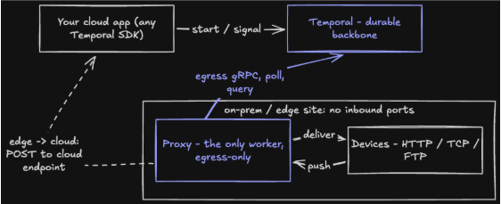

# Cloud ↔ Edge Durable Proxy

A **domain-agnostic, durable connector** that bridges any **Cloud** application and any **Edge** target (on-prem device, machine, or network) in both directions, with **Temporal** as the durable backbone. One proxy per install, **egress-only** (the edge site opens no inbound ports), and operator-configurable at runtime with **no redeploys**.

📹 **[Watch the 3-min walkthrough](https://www.loom.com/share/f09a24fa1fbf47b186079d00e5e7e375)** — dispatch HTTP/TCP/FTP round trips through the Switchyard UI, then watch a bad device config get hot-fixed remotely (no redeploy) while Temporal keeps retrying the failing send until it lands.

This README gets you oriented and running. For the rest:

| To…                                                              | See                                                                                 |
| ---------------------------------------------------------------- | ----------------------------------------------------------------------------------- |
| Wire your own cloud app to the proxy                             | [docs/integration.md](docs/integration.md)                                          |
| Understand hot reload, versioning, and per-transport reliability | [docs/internals.md](docs/internals.md)                                              |
| See the roads not taken and how to adapt the design              | [docs/design-alternatives.md](docs/design-alternatives.md)                          |
| Run a one-command end-to-end demo (cloud + edge + Switchyard UI) | [durable-proxy-app-demo](https://github.com/stephenmontague/durable-proxy-app-demo) |

---

## What it does

- Your **cloud app** dispatches messages to edge devices and receives messages back from them, without ever opening a connection _into_ the edge site.
- The **proxy** runs at the edge as the single Temporal worker. It speaks **HTTP, TCP** (incl. custom/MLLP-style wire protocols and persistent heartbeated sockets) **and FTP** to devices, and encodes/decodes **JSON, XML, or raw** payloads per message type.
- Temporal gives **exactly-once-style delivery** on top of at-least-once activities: duplicates collapse to one execution, and an offline proxy just means work waits in Temporal until reconnect.
- Everything domain-specific — message types, codecs, cloud endpoints, devices, routes — is **operational state held in a Temporal workflow** and hot-applied by the proxy, so operators reconfigure through the **Switchyard** UI (or cloud API) with no restart.

## How it works

<p align="center">  </p>

- **Control plane.** A singleton `ProxyControlWorkflow` (Workflow ID `proxy-control`) holds desired state. Your cloud drives it with **Updates** (config changes, validated synchronously) and a few **signals** (lifecycle); each accepted change **pushes a `reconcile` activity** to the proxy, which hot-applies it with no restart and reports back its applied state.
- **Cloud → Edge.** Your cloud starts a `DeliverToEdge` workflow (Workflow ID `{messageType}-{businessId}`, reuse policy `REJECT_DUPLICATE`). The proxy runs it: route → codec → connector → device channel.
- **Edge → Cloud.** The device pushes to a proxy ingress channel (an HTTP path, TCP port, or FTP folder _on the proxy_). The proxy starts a `DeliverToCloud` activity that **POSTs to your cloud endpoint** until it gets a 2xx.

> **Egress-only** means the edge site exposes no inbound ports. The proxy only ever _dials out_: to Temporal (gRPC — control plus the cloud→edge data path) and to your cloud app's API (the edge→cloud delivery POST). Devices connect to the proxy on the LAN, or the proxy dials them.

The mechanics behind each of these — reconcile internals, dedup, reliability per transport — are in [docs/internals.md](docs/internals.md).

## Repo layout

| Path                   | What it is                                                                                                                                                                            |
| ---------------------- | ------------------------------------------------------------------------------------------------------------------------------------------------------------------------------------- |
| [`proxy/`](proxy/)     | The connector itself — the only Temporal worker, egress-only                                                                                                                          |
| [`scripts/`](scripts/) | `proxy-supervisor.sh` — restart-on-exit wrapper for remote restarts                                                                                                                   |
| [`docs/`](docs/)       | [integration](docs/integration.md) · [internals](docs/internals.md) · [design alternatives](docs/design-alternatives.md) · [persistent TCP sessions](docs/persistent-tcp-sessions.md) |
| [`justfile`](justfile) | Build + run recipes (`just build`, `just run-proxy`, …)                                                                                                                               |

The root [pom.xml](pom.xml) is a thin Maven aggregator over `proxy/` — `mvn package` builds the proxy jar.

> **Reference stack (separate repo).** A stand-in cloud app, a stand-in edge device, and the **Switchyard** operations console live in [**durable-proxy-app-demo**](https://github.com/stephenmontague/durable-proxy-app-demo) — clone it next to this repo and run `just up` for a one-command end-to-end demo.

---

## Prerequisites

- Java 17+ (21 recommended), Maven, [`just`](https://github.com/casey/just), Temporal CLI **v1.7.0+**
- A local Temporal server on `localhost:7233` with **Server 1.31+** and the `activity.enableStandalone` dynamic config flag (required for the Standalone Activities the inbound path uses — a Public Preview feature). An always-on Docker stack works (`temporalio/server:1.31+`, Web UI at <http://localhost:8080>); without Docker, `just temporal-dev` starts an equivalent CLI dev server (Web UI <http://localhost:8233>).

## Run the proxy

```sh
just temporal-dev        # local Temporal dev server with standalone activities (no Docker; UI :8233)
just run-proxy           # the proxy (:8090, worker on proxy-main/proxy-control)
```

Under the restart-on-exit supervisor instead (enables the UI's RESTART button; optional namespace arg):

```sh
just run-proxy-managed   # e.g. just run-proxy-managed <ns>
```

A fresh proxy boots with the **`empty`** profile — no message types at all — so it stays idle until your cloud app defines a catalog and devices over the control plane.

> **Ports:** the proxy listens on `8090` (HTTP ingress), clear of the Docker Temporal UI (8080). Overridable via Spring env vars, e.g. `SERVER_PORT=9090 SPRING_TEMPORAL_CONNECTION_TARGET=127.0.0.1:7243 just run-proxy`.

### Try the full reference stack

To exercise the proxy end to end without writing a cloud app yet, use the companion [**durable-proxy-app-demo**](https://github.com/stephenmontague/durable-proxy-app-demo) repo — a stand-in cloud, a stand-in edge device, and the Switchyard console. Clone it next to this one:

```sh
git clone https://github.com/stephenmontague/durable-proxy-app-demo
cd durable-proxy-app-demo
just up                  # Temporal (if needed) + proxy (built from ../durable-proxy-app) + cloud + edge + UI
just demo-command        # DEVICE_COMMAND → device → COMMAND_RESULT → cloud (an HTTP round trip)
```

That repo builds and launches this proxy from `PROXY_DIR` (default `../durable-proxy-app`) and drives HTTP/TCP/FTP round trips, hot config reloads, runtime catalog edits, and persistent sessions. Its type names (`DEVICE_COMMAND`, cloud endpoint `/api/command-result`, …) are the **harness's, not the proxy's** — a fresh proxy bakes in none of them.

## Target Temporal Cloud

Activate the proxy's `cloud` Spring profile and provide the install's bootstrap mTLS credentials (namespace-per-install keeps the blast radius to that customer's own namespace):

```sh
TEMPORAL_TARGET=<ns-id>.<region>.tmprl.cloud:7233 \
TEMPORAL_NAMESPACE=<tenant>.<account-id> \
TEMPORAL_KEY_FILE=/path/client.key TEMPORAL_CERT_FILE=/path/client.pem \
java -jar proxy/target/proxy-app-*.jar --spring.profiles.active=cloud
```

Your cloud app connects to the same namespace — add mTLS to its Temporal client the same way (see [docs/integration.md](docs/integration.md)).

## Tests

```sh
just test      # Java: routing core, validators, codecs, TCP wire protocol, catalog signals
```

The Switchyard UI's WireString/validator parity tests (`just test-ui`) live with the UI in the [reference stack](https://github.com/stephenmontague/durable-proxy-app-demo).

## License

[MIT](LICENSE)
